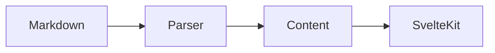

# Heading

这是一个用于测试内容引擎的内部页面，包含 **粗体**、*斜体*、~~删除线~~、`inline code` 和一个[外部链接](https://example.com)。

## Heading 2

### Heading 3

### List

- one
- two
- three

### Ordered list

1. one
2. two
3. three

### Task List

- [x] done
- [ ] todo

### Table

| Name | Type | Status |
| --- | --- | --- |
| SvelteKit | Framework | Active |
| Markdown | Content | Active |

### Quote

> 这是一个测试引用。

### Note

> [!NOTE]
> 这是一个 Note。

### Warning

> [!WARNING]
> 这是一个 Warning。

### Footnote

Markdown 渲染需要可靠的标题锚点。[^1]

[^1]: 这里是脚注测试。

### Highlighted code

```ts title="example.ts" {1,3}
const greeting = "Hello, SvelteKit";
console.log(greeting);
const count = 1;
```

```js
function hello(name) {
  return `Hello ${name}`;
}
```

```python
def hello(name):
    return f"Hello {name}"
```

```go
package main

import "fmt"

func main() {
    fmt.Println("Hello")
}
```

```bash
npm run check
npm run build
```

```json
{
  "name": "portal",
  "framework": "SvelteKit"
}
```

```yaml
site:
  language: zh-CN
  theme: dark
```

```css
.hero {
  display: grid;
  gap: 1rem;
}
```

```svelte
<script lang="ts">
  let count = $state(0);
</script>

<button onclick={() => count++}>
  {count}
</button>
```

### Mermaid



数学公式暂时保留为原始 Markdown，后续再决定是否引入 KaTeX。
